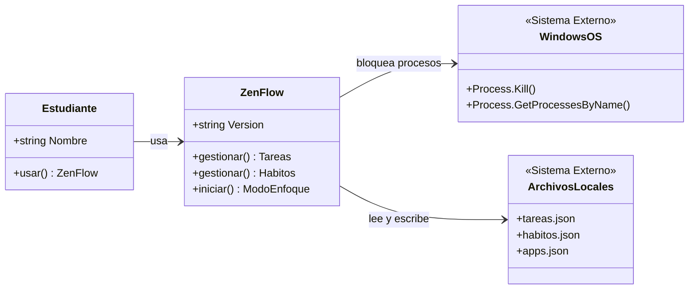

```mermaid
 classDiagram
    direction LR

    class Estudiante {
        +string Nombre
        +usar() ZenFlow
    }
    class ZenFlow {
        +string Version
        +gestionar() Tareas
        +gestionar() Habitos
        +iniciar() ModoEnfoque
    }
    class WindowsOS {
        <<Sistema Externo>>
        +Process.Kill()
        +Process.GetProcessesByName()
    }
    class ArchivosLocales {
        <<Sistema Externo>>
        +tareas.json
        +habitos.json
        +apps.json
    }

    Estudiante --> ZenFlow : usa
    ZenFlow --> WindowsOS : bloquea procesos
    ZenFlow --> ArchivosLocales : lee y escribe
```
